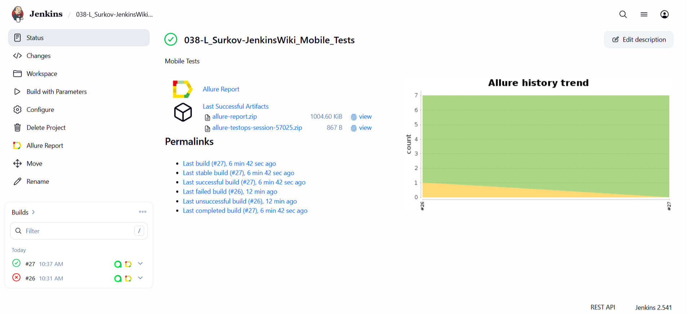
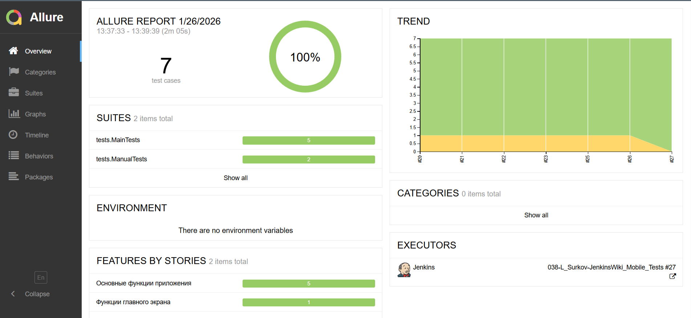
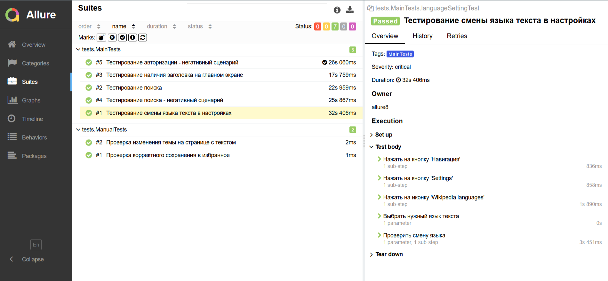
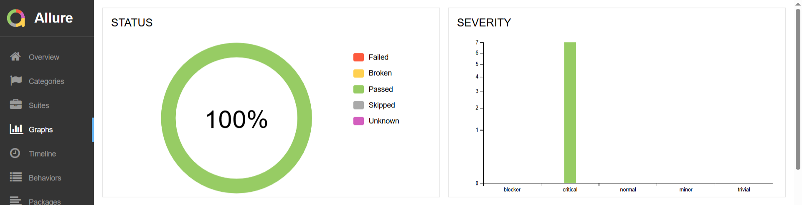
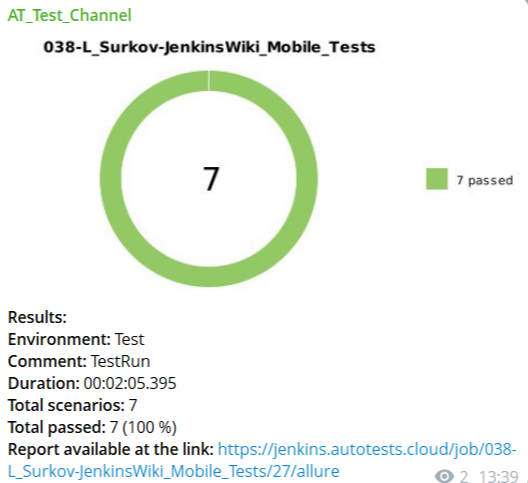
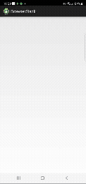


# Проект по автоматизации тестирования мобильного приложения [Wikipedia](https://play.google.com/store/apps/details?id=org.wikipedia&hl=ru)

> Wikipedia App — энциклопедический сервис, разработанный фондом Викимедиа, является официальным приложением интернет-энциклопедии Википедия для мобильных интернет-устройств.
> 
## **Содержание:**
____

* <a href="#tools">Технологии и инструменты</a>

* <a href="#cases">Примеры автоматизированных тест-кейсов</a>

* <a href="#jenkins">Сборка в Jenkins</a>

* <a href="#allure">Allure отчет</a>

* <a href="#allure-testops">Интеграция с Allure TestOps</a>

* <a href="#telegram">Уведомление в Telegram при помощи бота</a>

* <a href="#video">Примеры видео выполнения тестов на Selenoid</a>
____
<a id="tools"></a>
## <a name="Технологии и инструменты">**Технологии и инструменты:**</a>

<p align="center">  
<a href="https://www.jetbrains.com/idea/"></a>  
<a href="https://www.java.com/"></a>  
<a href="https://github.com/"></a>  
<a href="https://junit.org/junit5/"></a>  
<a href="https://gradle.org/"></a>  
<a href="https://selenide.org/"></a>  
<a href="https://aerokube.com/selenoid/"></a>  
<a href="ht[images](images)tps://github.com/allure-framework/allure2"></a> 
<a href="https://qameta.io/"></a>   
<a href="https://www.jenkins.io/"></a>  
<a href="https://ru.wikipedia.org/"></a>  
</p>

____
<a id="cases"></a>
## <a name="Список автоматизированных тест-кейсов">**Список автоматизированных тест-кейсов:**</a>
____
- ✓ *Проверка онбординга при первом запуске приложения*
- ✓ *Проверка строки поиска*
- ✓ *Проверка отображения ошибки при некорректном поисковом запросе*
- ✓ *Проверка возможности переключения языка в настройках приложения*
- ✓ *Проверка отображения ошибки при авторизации с невалидными данными*

## <a name="Список ручных тест-кейсов">**Список ручных тест-кейсов:**</a>

- ✓ *Проверка добавления и сохранения статей либо новостей в избранном*
- ✓ *Проверка изменения оформления текста через настройку Theme*
____
<a id="jenkins"></a>
## </a><a name="Сборка"></a>Сборка в [Jenkins](https://jenkins.autotests.cloud/job/038-L_Surkov-JenkinsWiki_Mobile_Tests/)</a>
____
<p align="center">  
<a href="https://jenkins.autotests.cloud/job/038-L_Surkov-JenkinsWiki_Mobile_Tests/"></a>  
</p>


### **Параметры сборки в Jenkins:**

- *ENVIRONMENT (тестовая среда, по умолчанию Test)*
- *PROP (конфигурация для запуска удалённо/на эмуляторе)*
- *BROWSERSTACK_USER (User_id из аккаунта BrowserStack)*
- *BROWSERSTACK_KEY (токен из аккаунта BrowserStack)*

<a id="console"></a>
## Команды для запуска из терминала
___
***Локальный запуск:***
```bash  
gradle clean mobile_main_tests 
-Dprop=${PROP}
-Dbrowserstack.user=${BROWSERSTACK_USER}
-Dbrowserstack.key=${BROWSERSTACK_KEY}
*Может быть использовано задание mobile_getting_started_tests для запуска тестов на экран онбординга
```

***Удалённый запуск через Jenkins:***
```bash  
clean mobile_main_tests
-Dprop=${PROP}
-Dbrowserstack.user=${BROWSERSTACK_USER}
-Dbrowserstack.key=${BROWSERSTACK_KEY}
*Может быть использовано задание mobile_getting_started_tests для запуска тестов на экран онбординга
```
___
<a id="allure"></a>
## </a> <a name="Allure"></a>Allure [отчет](https://jenkins.autotests.cloud/job/038-L_Surkov-JenkinsWiki_Mobile_Tests/allure/)</a>
___

### *Основная страница отчёта*

<p align="center">  
  
</p>  

### *Тест-кейсы*

<p align="center">  
  
</p>

### *Графики*

  <p align="center">  

</p>

____
<a id="telegram"></a>
## </a> Уведомление в Telegram при помощи бота
____
<p align="center">  
  
</p>

____
<a id="video"></a>
## </a> Пример видео выполнения одного из тестов на BrowserStack
____
<p align="center">
   
</p>

